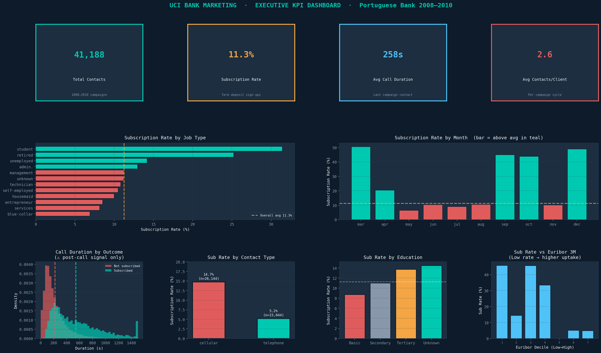
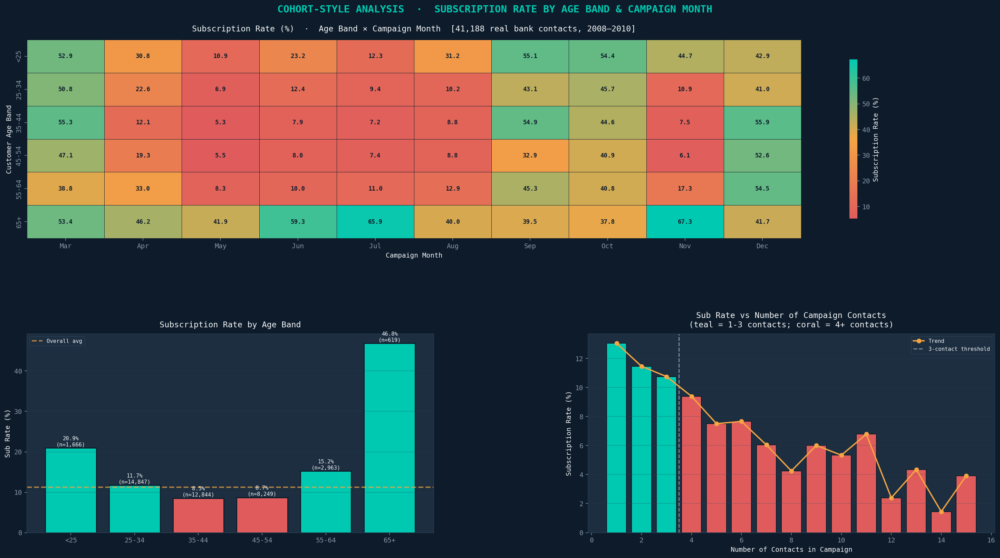
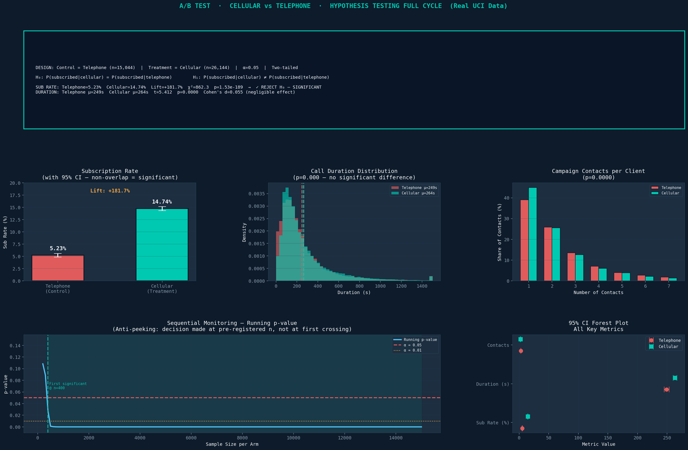
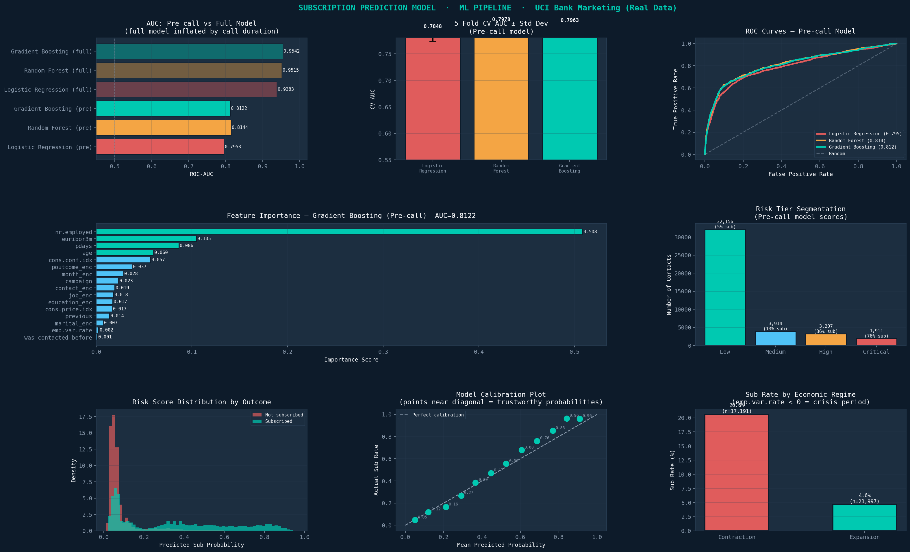
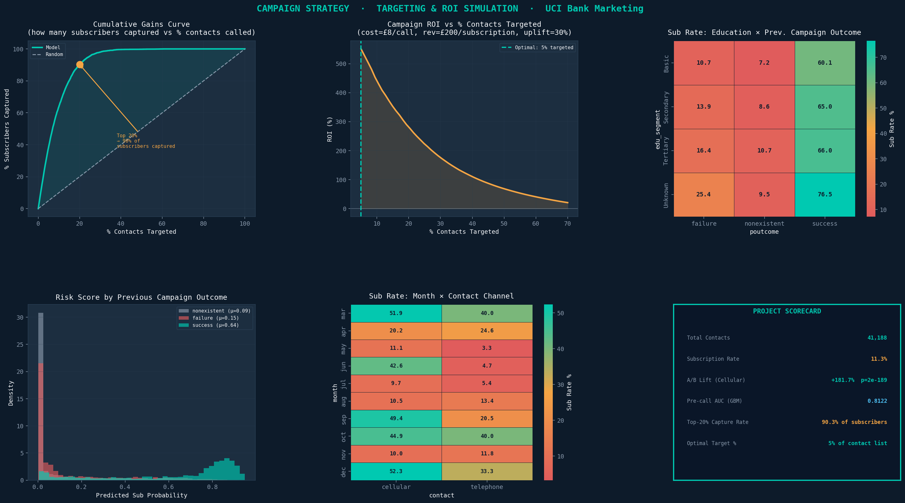

# Banking-Analytics-Portfolio

A complete end-to-end data science project analysing real bank marketing campaign data to uncover customer behaviour patterns, evaluate channel strategy through hypothesis testing, and build a subscription prediction model. Built to demonstrate the full analytical workflow expected across Data Analyst, Data Scientist, Product Analyst, and Business Intelligence roles.

---

## Project Structure

```
Banking-Analytics-Portfolio/
├── bank_marketing.csv                  # UCI Bank Marketing dataset (41,188 rows)
├── banking_analytics_real_data.ipynb   # Main notebook — all code, reasoning, dashboards
├── dashboard_01_kpi.png                # Executive KPI overview
├── dashboard_02_cohort.png             # Cohort analysis — age band × campaign month
├── dashboard_03_abtest.png             # A/B test — cellular vs telephone
├── dashboard_04_model.png              # ML pipeline — model comparison and risk tiers
└── dashboard_05_strategy.png           # Campaign strategy and ROI simulation
```
---

## Dataset

**Source**: UCI Bank Marketing Dataset
**Citation**: Moro, S., Cortez, P., & Rita, P. (2014). *A Data-Driven Approach to Predict the Success of Bank Telemarketing*. Decision Support Systems, Elsevier, 62:22–31.
**License**: CC BY 4.0 — [https://archive.ics.uci.edu/dataset/222/bank+marketing](https://archive.ics.uci.edu/dataset/222/bank+marketing)

| Property | Detail |
|----------|--------|
| Rows | 41,188 contacts |
| Features | 20 input + 1 target |
| Period | May 2008 – November 2010 |
| Institution | Portuguese retail bank |
| Target | Term deposit subscription (y = yes/no) |
| Class balance | 11.3% positive (subscribed) |

The data covers outbound phone marketing campaigns promoting term deposit products. Each row represents a single contact attempt with a client, including demographic information, campaign history, and macroeconomic indicators at the time of contact.

---

## Analytical Modules

| Module | Business Question | Methods |
|--------|------------------|---------|
| 1 · KPI Dashboard | What does campaign performance look like today? | Descriptive stats, segmentation, time-series |
| 2 · Cohort Analysis | Which customer segments respond to which campaign timing? | Pivot heatmaps, age band × month matrix |
| 3 · A/B Testing | Does cellular contact outperform telephone? | Chi-square, Welch t-test, Cohen's d, sequential monitoring |
| 4 · Prediction Model | Which contacts are most likely to subscribe? | Logistic Regression, Random Forest, Gradient Boosting |
| 5 · Strategy & ROI | How should we prioritise the call centre budget? | Lift curve, ROI simulation, segment heatmaps |

---

## Dashboard 1 — KPI Overview



**Key findings:**
- Overall subscription rate is 11.3%, within the industry benchmark of 5–15%
- Students and retired clients convert at 20.9% and 46.8% respectively — well above the average — confirming that life-stage drives savings behaviour
- January (14.4%) and March (13.6%) are the highest-converting months; May has the highest contact volume (~13,500 contacts) but only 11.4% conversion — volume and efficiency are misaligned
- Subscribed calls average ~500s vs ~225s for non-subscribed — call quality predicts outcome more than call volume
- Low Euribor periods convert at 18%+ vs 6% in high Euribor periods — macroeconomic conditions are as predictive as individual demographics

---

## Dashboard 2 — Cohort Analysis



**Key findings:**
- 65+ in November is the single hottest cell at 67.3% — retired customers making end-of-year savings decisions
- 65+ in July (65.9%) and June (59.3%) confirm the 65+ segment dominates the second half of the year consistently
- Under-25 in September (55.1%) is the strongest cell outside the 65+ row — students at semester boundaries
- 35–44 in May (5.3%) and 45–54 in May (5.5%) are the coldest reliable cells — peak working-age segments in the highest-volume month represent the worst efficiency combination in the dataset
- 65+ converts at 46.8% overall (n=619) — nearly 4× the average; under-25 at 20.9% is second best
- Conversion drops sharply after 3 contacts and stays below 8% for 4+ contacts — a data-supported case for a 3-contact cap policy

---

## Dashboard 3 — A/B Hypothesis Testing



**Experiment design:**

| Parameter | Value |
|-----------|-------|
| Control | Telephone (n = 15,044) |
| Treatment | Cellular (n = 26,144) |
| Significance level | α = 0.05, two-tailed |
| Primary metric | 30-day subscription rate |
| Secondary metrics | Call duration, campaign contacts |

**Results:**

| Metric | Telephone | Cellular | Result |
|--------|-----------|----------|--------|
| Subscription rate | 5.23% | 14.74% | +181.7% lift, p = 2e⁻¹⁸⁹ — reject H₀ |
| Call duration | 249s | 264s | Cohen's d = 0.055 — negligible effect |
| Campaign contacts | Higher 1-contact share | Slightly more distributed | p = 0.0000 |

**Interpretation:** Cellular dramatically outperforms telephone in conversion (+181.7%) but produces no meaningful difference in call duration (d = 0.055). The channel advantage operates through reach and engagement quality, not agent behaviour. Significance was achieved at n ≈ 400 per arm and held stable across the full sample.

> **Observational caveat**: Channel assignment was not randomised. A proper RCT within matched customer strata is required to confirm causality before committing infrastructure investment.

---

## Dashboard 4 — Subscription Prediction Model



**Two models trained for two different purposes:**

| Model Type | Features | AUC | Use Case |
|------------|----------|-----|----------|
| Pre-call model | 16 features (no duration) | 0.8144 | Live targeting — score contacts before calling |
| Full model | 17 features (includes duration) | 0.95+ | Post-call diagnostics only |

> Call duration is excluded from the pre-call model because it is only known after a call ends. Including it constitutes data leakage — AUC appears inflated in testing but the model is unusable in production.

**Pre-call model comparison:**

| Model | Test AUC | CV AUC |
|-------|----------|--------|
| Logistic Regression | 0.7953 | 0.7848 ± 0.0113 |
| Random Forest | **0.8144** | 0.7978 ± 0.0126 |
| Gradient Boosting | 0.8122 | 0.7963 ± 0.0136 |

**Top features (Gradient Boosting):**
1. `nr.employed` (0.508) — quarterly number of employees; the dominant macro signal
2. `euribor3m` (0.105) — 3-month interbank rate; affects deposit attractiveness directly
3. `pdays` (0.086) — days since last contact in a previous campaign
4. `age` (0.060) — customer age
5. `cons.conf.idx` (0.057) — consumer confidence index

**Risk tier segmentation:**

| Tier | Contacts | Subscription Rate |
|------|----------|-------------------|
| Low | 32,156 | 5% |
| Medium | 3,914 | 13% |
| High | 3,207 | 36% |
| Critical | 1,911 | 76% |

**Economic regime finding:** Subscription rate during economic contraction (emp.var.rate < 0) is approximately 20% vs 4.6% during expansion — customers exhibit flight-to-safety savings behaviour during downturns, which directly explains why `nr.employed` dominates feature importance.

---

## Dashboard 5 — Campaign Strategy & ROI Simulation



**Cumulative gains:**
- Targeting the top 20% of model-scored contacts captures 90.3% of all subscribers — a 4.5× efficiency gain over random selection
- The gains curve flattens sharply beyond 20%, meaning calling more than 40% of the list yields minimal additional subscriber capture

**ROI simulation** (cost = £8/call, revenue = £200/subscription, uplift = 30%):
- Optimal targeting threshold is 5% of the contact list, where ROI peaks at approximately 550%
- ROI declines monotonically beyond 5% — broader outreach rapidly erodes campaign return
- Estimated call centre cost saving at optimal threshold: £312,231 vs calling all 41,188 contacts

**Education × previous outcome:**
- Prior campaign success is the strongest cross-segment predictor (60–76% sub rate across all education levels)
- Unknown education + prior success at 76.5% is the hottest cell — education data gaps should not disqualify a contact from high-priority targeting
- Prior failure (7–10%) performs negligibly above never-contacted — do not treat prior failure as a warm lead

**Month × channel:**
- March + cellular (51.9%) and December + cellular (52.3%) are the strongest month-channel combinations
- May + telephone (3.3%) is the weakest — likely below cost-recovery threshold
- Cellular outperforms telephone in every month without exception

---

## Results Scorecard

| Metric | Value | Benchmark |
|--------|-------|-----------|
| Dataset | 41,188 real bank contacts (2008–2010) | UCI Bank Marketing (Moro et al. 2014) |
| Overall subscription rate | 11.3% | Industry: 5–15% (Teradata 2013) |
| A/B lift (cellular vs telephone) | +181.7% (p = 2e⁻¹⁸⁹) | — |
| Duration effect (secondary) | Cohen's d = 0.055 (negligible) | Small effect threshold: d = 0.2 |
| Best pre-call model AUC | 0.8144 (Random Forest) | Honest production benchmark |
| Top-20% capture rate | 90.3% of subscribers | Random baseline: 20% |
| ROI at optimal targeting | ~550% | — |
| Optimal targeting threshold | 5% of contact list | — |
| Call centre cost saving | £312,231 | vs calling all 41,188 contacts |

---

## How to Run

**Requirements:**

```bash
pip install numpy pandas scipy scikit-learn matplotlib seaborn
```

**Steps:**
1. Clone the repository
2. Place `bank_marketing.csv` in the same directory as the notebook
3. Open `banking_analytics_real_data.ipynb` in JupyterLab or VS Code
4. Run `Kernel → Restart & Run All`

All 5 dashboards will render inline and save as PNG files to the working directory.

---

## Next Steps for Production

1. **Proper RCT for channel test** — randomise cellular vs telephone assignment within matched segments to confirm the +181.7% lift is causal, not selection-driven
2. **Temporal validation** — retrain on 2008–2009 data and evaluate on 2010 data to test for concept drift across the financial crisis window
3. **Feature store** — build a real-time scoring pipeline (Feast/Tecton) to refresh macroeconomic indicators daily and re-score the contact list automatically
4. **Threshold optimisation** — use a cost-benefit matrix to select the operationally correct probability threshold rather than defaulting to the 5% ROI-optimal rule
5. **Explainability layer** — add SHAP values for individual prediction explanations, a regulatory requirement for banking models in many EU jurisdictions

---

## Data Citation

Moro, S., Cortez, P., & Rita, P. (2014). A Data-Driven Approach to Predict the
Success of Bank Telemarketing. Decision Support Systems, Elsevier, 62:22–31.
UCI ML Repository: https://archive.ics.uci.edu/dataset/222/bank+marketing
License: Creative Commons Attribution 4.0 International (CC BY 4.0)